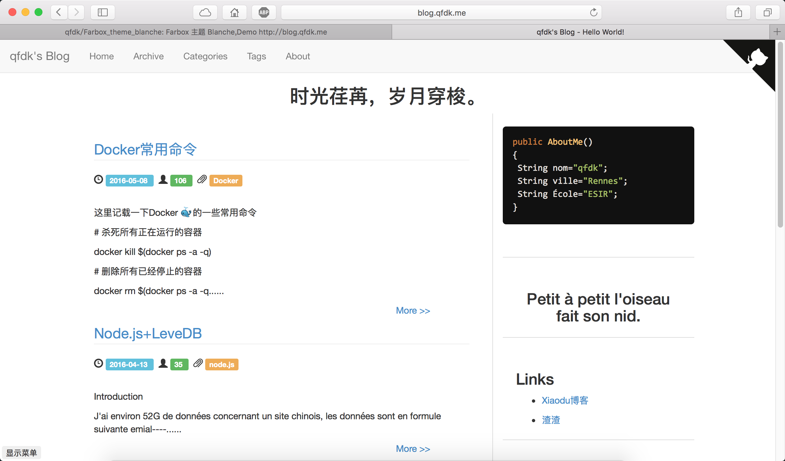

## Farbox theme - Blance

为了夏天清爽一点点，就弄了这个主题，最近大家都在搞什么博客速度优化，这里我就从主题里面优化一下，速度嘛一般500ms 就可以载入完成主页，自己感觉还是比较满意的。过一阵子有空了再撸一个滑动加载文章的功能。

## 简单说明
* 使用BootStrap 3 作为按钮等等的基本
* 感谢Farbox提供api以及开放的模板
* 禁止用于商业用途

## 截图

## 使用说明
* 复制`template`文件夹到Frabox 里面的项目的根目录，刷新网站即可.

or

* 直接访问 [这里](http://blog.qfdk.me/template) 来直接复制模板(推荐).

## 写在最后
* 效果参照本人blog <http://blog.qfdk.me>.
* 完成于 09/05/2016
* Rennes
* by 清风刀客